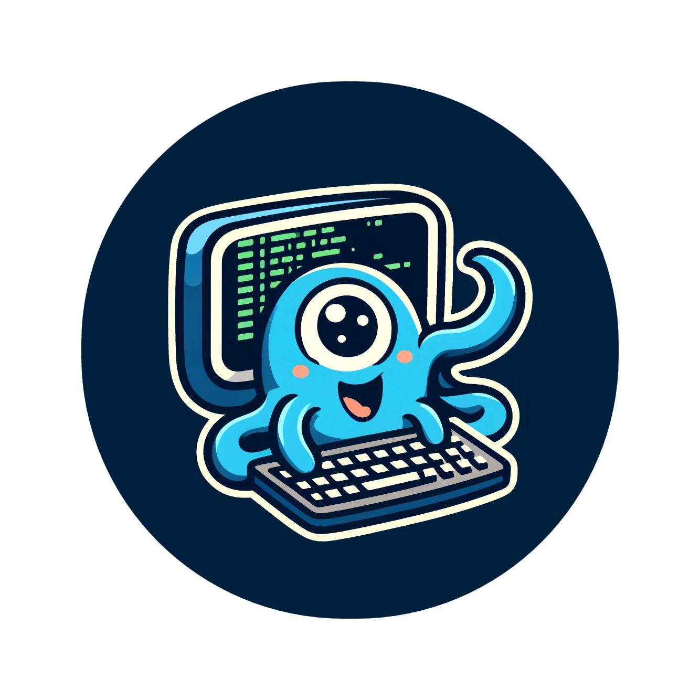

<h1 align="center"> ScyllaSH </h1>



> A Better CQLsh REPL Built in Rust

**ScyllaSH** is a powerful and user-friendly REPL (Read-Eval-Print Loop) for ScyllaDB and Cassandra, designed to be a
superior alternative to the default `cqlsh`. Built with Rust and leveraging the `ratatui` library for an enhanced
terminal interface, ScyllaSH offers a range of features that make working with CQL (Cassandra Query Language) more
efficient and enjoyable.

## Key Features

- **Enhanced REPL Experience**: ScyllaSH provides a more intuitive and responsive command-line interface, making it
  easier to execute CQL commands, navigate history, and manage sessions.

- **Real-Time Metrics**: Monitor key metrics directly within the REPL. ScyllaSH displays performance statistics such as
  query latency, node health, and resource utilization, enabling you to make informed decisions as you work.

- **Auto-Completion**: ScyllaSH includes advanced auto-completion for CQL keywords, table names, and columns, reducing
  the need for constant reference checking and speeding up your workflow.

- **Syntax Highlighting**: With built-in syntax highlighting, ScyllaSH helps you spot errors and understand complex
  queries at a glance.

- **Improved History Management**: ScyllaSH retains your command history across sessions, making it easy to recall and
  re-execute previous commands.

- **Customizable Settings**: Tailor the REPL environment to your preferences with configurable settings for colors,
  prompts, and more.

- **Extensible with Plugins**: ScyllaSH supports plugins, allowing you to extend its functionality with custom commands,
  integrations, and tools.

## Installation

ScyllaSH is distributed as a standalone binary. You can install it via Cargo (Rust's package manager) or download the
pre-built binaries from the [releases page](https://github.com/your-repo/ScyllaSH/releases).

### Via Cargo

```bash
cargo install scyllash
```

### Pre-built Binary

1. Download the appropriate binary for your operating system from
   the [releases page](https://github.com/your-repo/ScyllaSH/releases).
2. Extract the binary to a directory in your `$PATH`.
3. Run `scyllash` from your terminal.

## Usage

To start ScyllaSH, simply run:

```bash
scyllash
```

By default, ScyllaSH will attempt to connect to a ScyllaDB or Cassandra instance running on `localhost` at the default
CQL port (`9042`). You can specify a different host and port using command-line arguments:

```bash
scyllash --host <your-host> --port <your-port>
```

Once connected, you'll be greeted with the ScyllaSH prompt where you can start entering CQL commands. Use `Ctrl+D` to
exit the REPL.

## Configuration

ScyllaSH can be configured using a configuration file located at `~/.config/scyllash/config.toml`. Here, you can
customize various aspects of the REPL, such as:

- Prompt style
- Color scheme
- Metrics display options
- Plugin settings

Example configuration file:

```toml
[connection]
hostname = "127.0.0.1"
port = 9042
username = "scylla"
password = ""
timeout = 10

# [scyllash]
# prompt = "scyllash> "
# color_scheme = "solarized_dark"

# [cql]
# version = "3.3.1"

# [metrics]
# enabled = true
# refresh_interval = 5
```

## Contributing

We welcome contributions from the community! Whether it's bug reports, feature requests, or pull requests, your help is
appreciated. Please check out our [contributing guide](CONTRIBUTING.md) for more details.

## License

ScyllaSH is licensed under the MIT License. See the [LICENSE](LICENSE) file for more details.

## Acknowledgments

ScyllaSH is inspired by the need for a more powerful and flexible CQLsh experience. Special thanks to the creators of
Rust, Ratatui, and ScyllaDB for providing the tools and inspiration to make this project possible.

---

Start supercharging your CQLsh experience today with ScyllaSH! 🚀
